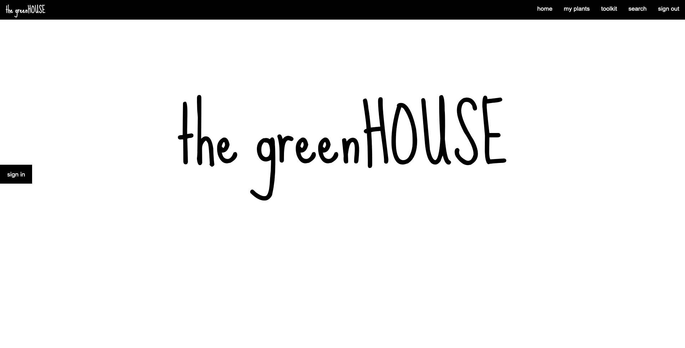
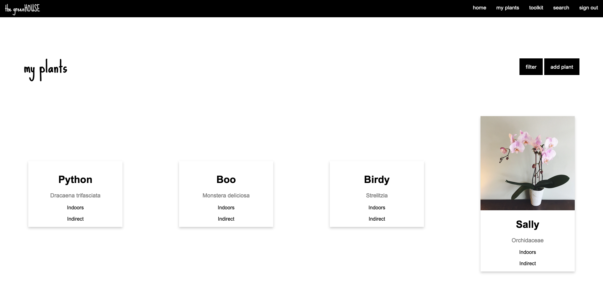
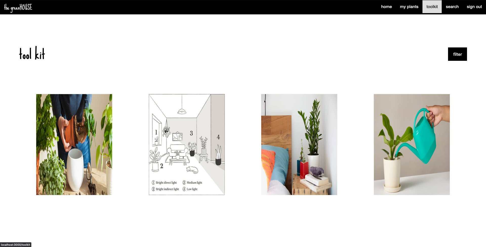
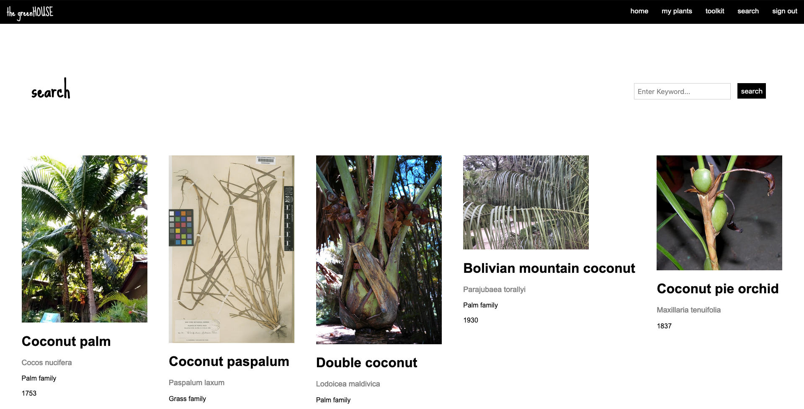

# The Greenhouse 

## Overview

Studies show that having plants in your home can boost productivity, improve concentration, reduce stress levels and improve your mood. Having a place to keep track of the plants in your home, when to water them, how much light they need, and find new plants to add your collection, could help you keep your plants alive, and be a great source of relief. That's where The Greenhouse comes in.  

The Greenhouse is a web app that serves as a plant manager, allowing users to add the plants of their home to get information on when to water them, how much to water them, and how much light they need, and search for other plants for their home. The Greenhouse would be an all-in-one place for plant care, with a space to view your plants, a toolkit to help take care of them, and a place to explore and find new plants to add to your plant family.


## Data Model


The application will store Users, Plants and Plant Details

* users can have multiple plants (via references)
* each plant can have multiple informative details (by embedding)


An Example User:

```javascript
{
  username: "ivannpe",
  hash: // a password hash,
  plants: // an array of references to plant information
}
```

An Example List with Embedded Items:

```javascript
{
  user: // a reference to a User object
  name: "Plants",
  plants: [
    { name: "Pothos", nickname: "Beauty",    
        image_url: "imagelink", space: "Indoors", 
        waterFreq: "Weekly", light: "Direct", watered: true},  
    { name: "Albies Alba", nickname: "Margo",    
        image_url: "imagelink", space: "Outdoors", 
        waterFreq: "Bi-Weekly", light: "Direct", watered: false},
  ],
}
```


## Wireframes

/home - page for site information and features



/myplants - page to view all plants



/toolkit- page for tool kit to help take care of plants

  

/search- page to search for new plants



## Site map


## User Stories or Use Cases


1. as non-registered user, I can register a new account with the site and learn about site features
2. as a user, I can sign in to the site
3. as a user, I can add a plant
4. as a user, I can view all of the plants I have added
5. as a user, I can search in the toolkit to learn more about how to take care of my plants  


## Annotations / References Used

1. [Trefly API Documentation](https://docs.trefle.io/)  
